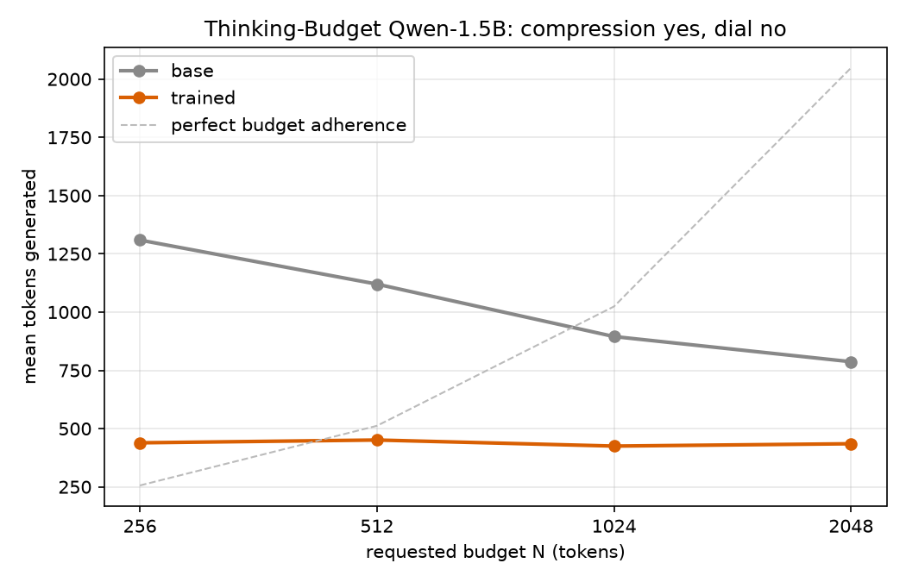

# thinking-budget

Experiments toward a small reasoning model with a controllable token budget. The released
run-3 adapter compresses responses but does **not** provide a working budget dial. GGUF and
the controllable-model release remain pending.

**Current workflow: [RECOVERY.md](RECOVERY.md).** It adds a frozen reference-model comparison,
per-response evaluation evidence, and a supervised-conditioning pilot before further GRPO.
The historical run notes and commands below describe earlier experiments; follow RECOVERY.md
for new work. Token budgets currently measure the whole generated completion, not reasoning alone.

The [50-problem reference comparison](results/control-2026-09-08/STATUS.md) passed on
2026-09-09: released L1 tracks 512/1024/3600-token requests; run 3 still does not.
This validates the evaluation path, not a new student model or a release.

The [102-problem SFT pilot](results/pilot-2026-09-09/STATUS.md) completed training but failed
held-out budget control and final-answer accuracy. GRPO is blocked on a better conditioning pilot.
The 2026-09-10 grading audit fixes credit for unfinished, prefilled reasoning; original outputs
are retained. The pilot report also records a rental cleanup error and the verified-deletion fix.

The [September 13 small SFT diagnostic](results/sanity-2026-09-13/STATUS.md) learned a strong
budget response on 24 training problems, but both loss-weighting variants missed the preset
length-precision gate. The larger pilot remains blocked. Results and both checkpoints are
backed up; the GPU was verified deleted after $0.519 in reported charges.

Reward: `r = 1[answer correct] − α·|N − tokens_used|` (LCPO-Exact, α=3e-4), correctness via `math-verify`.
Both overshoot and undershoot are penalized; learning to condition on N is not guaranteed.
`--length-reward max` retains our legacy additive overshoot penalty. It is **not** the published
L1-Max recipe, which uses a correctness-gated clipped reward and starts from L1-Exact.

The prompt wording must match the reward variant ("exactly N" for Exact, "maximum N" for Max). It is set in one place — `TB_LENGTH_REWARD`, read by `rewards.budget_instruction()` — because `prepare_data.py`, `eval_budget.py` and `profile_inference.py` build prompts in separate processes and run 1 was lost to them disagreeing. `train_grpo.py` reads the wording back off `data/train` and refuses to start on a mismatch.

## Try it

[](https://colab.research.google.com/github/rk9595/thinking-budget/blob/main/demo_colab.ipynb)

`demo_colab.ipynb` runs the base model and the adapter side by side on a free T4. It loads
the base once and toggles the LoRA with `disable_adapter()`, so the two columns are the same
weights with and without the delta — no second download, nothing to mismatch.



Output of that notebook on 2026-08-28, four short arithmetic/algebra problems per budget:

| budget | base tokens | trained tokens | compression |
|---|---|---|---|
| 256 | 1309 | 439 | 3.0x |
| 512 | 1120 | 451 | 2.5x |
| 1024 | 895 | 425 | 2.1x |
| 2048 | 787 | 435 | 1.8x |

Trained spread across budgets: **1.06x** (1.00x would be a fully inert dial). On one
problem at budget 512 the base wrote 3633 tokens and the adapter 870 — 4.2x shorter, same
answer.

Read the chart as two separate claims. The **gap** between the lines is what the training
bought. The **flatness** of the orange line, against the dashed ideal, is what it did not:
the budget in the prompt is close to inert, which is the same 1.08x result the full n=100
eval found.

Three caveats, because four problems is not a measurement:
- Absolute counts are far below the n=100 numbers below (440 vs 787 trained) because these
  problems are much easier than MATH-500. The ratios transfer; the counts do not.
- The base line sloping *down* with budget is almost certainly noise — one rambling
  generation moves a 4-sample mean by hundreds of tokens — not the base model responding
  to N. Raise `N_PROBLEMS` in the notebook to check it.
- No accuracy is measured here. For the correctness cost of the compression see
  `results/run-2026-08-24-exact/`.

Raw numbers: `results/demo-2026-08-28/demo.json`.

## Run history

**2026-08-24/25 (LCPO-Exact, 600 steps, 8.4h) — run 3: no dial, but a real compression result.** Exact penalizes undershoot as well as overshoot, which should force conditioning on N in both directions. It did not. MATH-500 mean tokens 781/783/763/821 across budgets 256/512/1024/2048 — a **1.08x spread**. The sweep shows tokens compressing (2178 → 965 → 776 → 751 at steps 100/250/500/600) while the spread never exceeds 1.17x: the model regressed to the **conditional mean** of the budget distribution rather than learning to read N.

What it did buy is efficiency: **MATH-500 2524 → 787 tokens (3.2x) for −2.0 accuracy points**, GSM8K 1239 → 457 (2.7x) for −5.2. Run 2 paid 8–13 points for less.

Reported `kl` was **0.006**, versus run 2's 0.03 at an identical LR; `frac_reward_zero_std` and `clipped_ratio` were both 0. These metrics do not establish why conditioning failed or prove that optimization was healthy. Final `rewards/length_reward/mean` −0.199 implies mean |n−N| ≈ 660 tokens. Archived at `results/run-2026-08-24-exact/`; curves in W&B run `vt32er6f`.

### Where this diverges from L1

| | L1 | run 3 |
|---|---|---|
| starting model | **DeepScaleR-1.5B-Preview** (already RL fine-tuned) | DeepSeek-R1-Distill-Qwen-1.5B (raw distill) |
| method | **full fine-tune** | LoRA r=32 |
| budget range | **U(100, 4000)** | U(200, 2000) |
| data | 40K | 8K |
| steps | 700 | 600 |

The budget range is the one filed as a *fix* after run 1: L1 straddles the model's natural ~2500-token length, this run sat entirely below it. A model that ignores N and emits a constant pays the mean absolute deviation of the budget distribution, `(b−a)/4` for `U(a,b)` — **450 tokens here against L1's 975**, so refusing to condition was 2.2x cheaper than in the paper. At α=3e-4 that is a 0.135 penalty against a correctness spread of 0.44; under L1's range the same constant strategy costs 0.293.

This is a hypothesis about the raw reward, not an established diagnosis. Uniform shortening can improve reward when samples overshoot, but it does not solve the Exact objective. In a group whose completions all exceed N, the length reward is `αN − αn`; group centering cancels `αN`, leaving a preference for shorter completions independent of the requested budget. Widening the range and raising α are not interchangeable under group-normalized optimization. Sampling diversity, the starting policy, full fine-tuning versus LoRA, and response-group count also differ from L1.

**The range-only Run 4 proposal in [RUN4.md](RUN4.md) is superseded by [RECOVERY.md](RECOVERY.md).** Verify the released reference control, then test supervised conditioning on verified traces before spending on another GRPO run.

**2026-08-23 (LCPO-Max, 700 steps, 7.6h, $8.12) — partial success.** All three run-1 fixes worked: `kl` 6e-4 → 0.03, mean completion length 4096 → 670, `clipped_ratio` 0.97 → 0. Ceiling compliance is real — MATH-500 over-budget rate 87% → 3% at budget 1024, 53% → 0% at 2048. **But mean tokens is flat across budgets** (490/559/546/528 for 256/512/1024/2048): the model learned "always be short", not "condition on N", which is the degenerate solution of a max-only reward — nothing penalizes finishing early, so nothing pulls length *up* toward the budget. Collapse was complete by step 100. Accuracy cost: MATH-500 −8 to −13 pts, GSM8K −1 to −5. Training-time correctness did not reveal this (0.298 → 0.277, noise-dominated at 32 samples/step); only held-out eval did. Archived under `results/run-2026-08-23-max/` (code snapshot in `code/`).

**2026-08-22 (LCPO-Exact, 1000 steps, $24.75) — negative result.** Mean tokens stayed flat across budgets (2190/2197/2225/2229 on MATH-500 for budgets 512/1024/2048/3600); accuracy was unharmed. Archived under `results/run-2026-08-22-exact/`, adapter at [rk9595/thinking-budget-qwen1.5b-lcpo](https://huggingface.co/rk9595/thinking-budget-qwen1.5b-lcpo). Three causes, all fixed on `main`:

1. **The policy never moved.** `grad_norm` ~0.004 and `kl` ~6e-4 end to end at `lr=5e-6`. That is a full-finetune LR applied to a LoRA adapter; LoRA needs roughly 10x more. Now `2e-5`.
2. **Prompt and reward disagreed.** The prompt said "Think for **maximum** N tokens" while the reward was LCPO-**Exact** (`−α·|N − n|`), which pays the model to pad up to N. Now LCPO-Max by default, matching the prompt.
3. **A third of the data pushed the wrong way.** Budgets were sampled 100–3600 against a natural length of ~2500, so high-budget examples rewarded writing *longer*. Now 200–2000, entirely below the natural length, with the 4096 completion cap left as headroom.

## Historical environment issue (vLLM 0.27 + Python 3.11)

Export `VLLM_USE_FLASHINFER_SAMPLER=0` and `pip uninstall -y flashinfer-python` before any
vLLM run. flashinfer 0.6.x fails to import on Python 3.11 (`array.array is not
subscriptable`), but vLLM's `flashinfer_sampler_supported()` imports the backend
unguarded, so simply removing the package trades one crash for a `ModuleNotFoundError`.
The env var short-circuits before that import; both are needed for that historical environment.
The recovery workflow uses Python 3.12 and pinned CUDA dependencies; do not apply this workaround
to the validated A100 environment, where FlashInfer works.

## Setup

```bash
uv venv .venv --python 3.12
uv pip install --python .venv/bin/python -r requirements.txt  # macOS
# On Linux CUDA instead: bash setup_gpu.sh
```

## Historical training commands (not the recovery sequence)

For new experiments, follow [RECOVERY.md](RECOVERY.md). The commands below describe the old
direct-to-GRPO workflow and do not include the reference or SFT gates.

```bash
python -m pytest tests/ -q                     # 11 reward unit tests
python prepare_data.py                         # DeepScaleR subset + budget injection -> data/train
python prepare_data.py --num-samples 64 --out data/smoke
python train_grpo.py --smoke --data data/smoke # 2-step Qwen3-0.6B run to validate the loop
python eval_budget.py --out results/base.json  # baseline: base model ignores budgets
python train_grpo.py --output-dir checkpoints/lcpo-exact --max-steps 1000   # main run (A100)
python eval_budget.py --lora checkpoints/lcpo-exact/checkpoint-1000 --out results/trained.json
python plot_results.py                         # curves + markdown table for the model card
bash export_gguf.sh checkpoints/lcpo-exact/checkpoint-1000 out/l1-qwen-1.5b
```

On a rented GPU box, `bash setup_gpu.sh` installs the CUDA lock and runs tests. It does not
prepare data or start training, and public-model evaluation needs no credentials.
`rent_and_run.sh` is disabled: its historical SSH-linked teardown was unsafe for long runs.
Provision with an explicit spending limit, run detached, retrieve artifacts, and then destroy
only the temporary instance. Evaluation never automatically publishes a model.

Resume an interrupted run with `--resume`. Training logs to W&B; watch `rewards/correctness_reward/mean` (should not decrease) and `rewards/length_reward/mean` (should rise toward 0 as the model learns to hit the budget). Note TRL names that metric after the reward function's `__name__`, so it is `length_reward_max` for LCPO-Max and `length_reward` for LCPO-Exact — a grep written for one silently matches nothing on the other. Also watch `frac_reward_zero_std`: if it stays near 1, every completion in a group scores identically, advantages are zero and GRPO learns nothing. And watch `kl` — if it is still ~1e-4 after a few hundred steps the policy is frozen and the run is already dead, whatever the reward curve looks like.

`--smoke` runs on CPU — the trainer's generation path hits `probability tensor contains inf/nan` on Apple MPS (plain `model.generate` on MPS is fine, so this is inside Trainer/accelerate, not the reward code). It takes ~60s/step on an M-series Mac and completions clip at 64 tokens, which is expected; it validates wiring only, not learning.

## Eval

`eval_budget.py` records raw responses, generated token IDs, stopping reasons, accuracy,
absolute/relative length error, truncation, and paired budget response. The current frozen
comparison uses MATH-500 development problems and budgets {512, 1024, 3600}, with the same
8192-token generation ceiling for every budget. The older {256, 512, 1024, 2048} results
remain historical; they are not directly interchangeable with the current evaluation.

Success for LCPO-Exact = `mean_tokens` rises monotonically with the budget and tracks the y=x line in `tokens_vs_budget.png` (this is the headline plot — it is the one thing run 2 failed), `mean_abs_deviation` well below base at every budget, and accuracy rising with budget. Accuracy at the top budget matching the base model would be a bonus, not a pass condition: this is LoRA r=32, not the full fine-tune the L1 paper reports.

For LCPO-Max the criterion is different and weaker — `overshoot_rate` falls sharply at every budget — because a model that is uniformly short satisfies it without learning anything.
